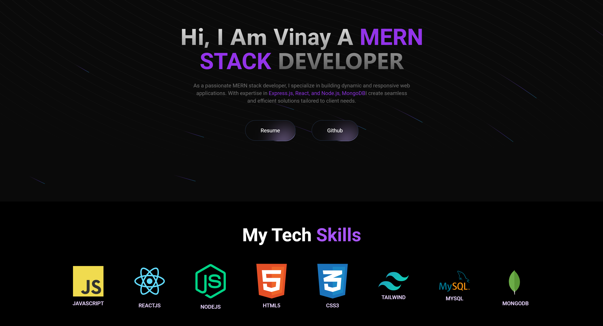

# Vinay Portfolio

## Live Site

[Visit my portfolio website](https://portfolio-prajapati.onrender.com)

# Description
## Overview

Welcome to my portfolio! I am a passionate MERN stack developer with experience in creating dynamic and responsive web applications. This portfolio showcases some of the projects I have worked on and provides more information about my skills and experience.

## Features

- **Hero Section:** An engaging introduction with a brief overview of my skills and background.
- **Project Section:** A showcase of my notable projects with descriptions and links.
- **Timeline Component:** A visual representation of my career milestones and achievements.
- **Approach:** Insights into my development process and methodologies.
- **Contact Section:** Easy ways to get in touch with me for collaboration or inquiries.
- **GitHub Globe:** A visual representation of my contributions on GitHub.
- **Footer:** Quick links to my social media profiles and contact information.

## Technologies Used

- **Frontend:** React.js, Tailwind CSS
- **Backend:** Node.js, Express.js
- **Database:** MongoDB
- **Other:** Vite, Redux Toolkit

